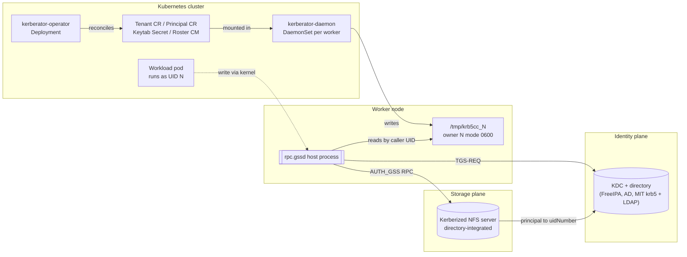
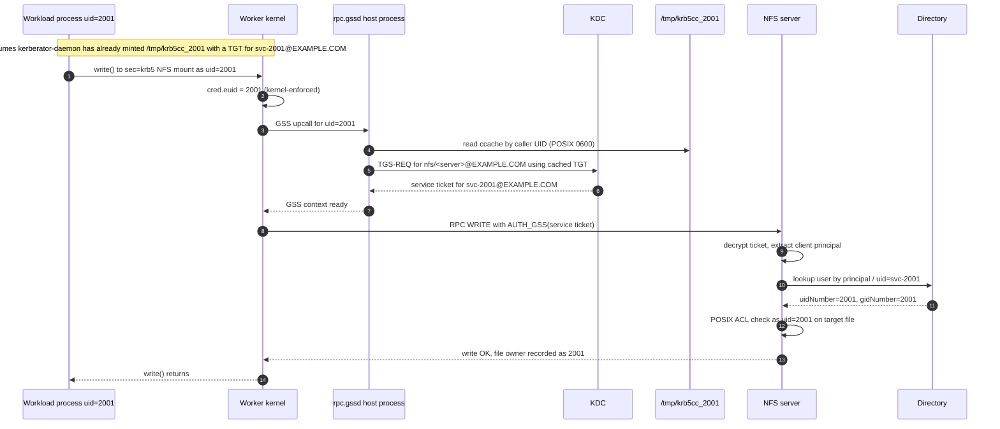

# Kerberator security model

This document walks through Kerberator's security model end-to-end,
using a Kerberized NFS mount as the concrete example. It's aimed at
operators and reviewers who understand Kubernetes, Kerberos, and NFS
individually but want to see how Kerberator ties them together.

> **The one-sentence version.** Kerberator projects one Kerberos
> identity per POSIX UID onto every Kubernetes worker node, so a
> workload pod running as UID N can transparently authenticate to
> `sec=krb5` NFS mounts as the directory user with `uidNumber=N` —
> without ever holding a keytab itself.

The rest of this doc unpacks what "one identity per UID" actually
means and where each enforcement point lives.

## The cast of characters

Six components participate in every authentication:

| Component | Runs where | Holds what |
|---|---|---|
| **KDC + directory** | Outside the cluster (FreeIPA, Active Directory, or MIT krb5 alongside an LDAP directory) | Kerberos principals and their keys; POSIX user records with `uidNumber`, joined to principals |
| **Kerberized NFS server** | Your storage (Linux knfsd, NetApp, PowerScale, etc.) | Its own service keytab (`nfs/<server>@EXAMPLE.COM`); a directory binding so it can translate principals → POSIX identities |
| **kerberator-operator** | K8s Deployment in the operator namespace (`kerberator-system`) | Reconciles Tenant + Principal CRs into the aggregated roster + keytab Secret + DaemonSet |
| **kerberator-daemon** | DaemonSet, one Pod per worker node, in the Tenant namespace (e.g. `kerberator-demo`) | Reads the mounted keytab Secret + roster; `kinit`s per UID; writes ccaches to the host's `/tmp` via a hostPath mount |
| **Workload pod** | Any namespace, running as `runAsUser: N` | Nothing Kerberos-related. No keytab, no hostPath, no cross-namespace RBAC. Just does I/O as UID N |
| **rpc.gssd** | Linux host process on every worker | Reads `/tmp/krb5cc_<UID>` on demand from the kernel NFS client |

The critical property to internalize: **the workload pod is
Kerberos-illiterate.** It never sees a keytab, never runs `kinit`,
never talks to the KDC. All of the Kerberos plumbing lives OUTSIDE
the pod, on the host and in the Tenant namespace.

## The naming convention

Everything is keyed off a single number: the POSIX UID. Once you
pick UID `N`, every resource name and label follows a fixed
template. Using `N = 2001` as the running example:

| Object | Name / Value | Lives in |
|---|---|---|
| POSIX UID | `2001` | Everywhere identity is enforced (kernel, filesystem, ownership metadata) |
| Directory user record | `uid=svc-2001, uidNumber=2001, gidNumber=2001` | KDC's directory |
| Directory group record | `cn=svc-2001, gidNumber=2001` | KDC's directory |
| Kerberos principal | `svc-2001@EXAMPLE.COM` | KDC |
| Keytab file | `svc-2001.keytab` (binary, holds the KVNO'd key for the principal) | K8s Secret `svc-2001-keytab` in the Tenant namespace |
| Principal CR name | `uid-2001` (`.spec.uid: 2001`, `.spec.principal: svc-2001@EXAMPLE.COM`) | Tenant namespace (e.g. `kerberator-demo`) |
| Workload namespace | Any; on OpenShift, annotated `openshift.io/sa.scc.uid-range: 2001/1` | Cluster-scope |
| Workload pod `runAsUser` | `2001` | Pod spec |
| Ccache file | `/tmp/krb5cc_2001` (owner `2001:2001`, mode `0600`) | Every worker node's host `/tmp` |

**The whole design collapses into a single joining key**: the
Kerberos principal `svc-<N>@EXAMPLE.COM` on the client side, mapped
by the directory to `uidNumber=<N>` on the server side. Everything
else — the CR name, the ccache filename, the SCC annotation — is
just administrative convention that keeps humans sane.

## What must be in place

Kerberator's own scope is narrow: it materializes the Kubernetes
plane (section 2 below) once you've configured the identity plane
and the storage plane. Kerberator will not stand in for a missing
directory user or an NFS server that squashes non-root identities.

### 1. Provisioning principals and keytabs

Any Kerberos KDC works: FreeIPA, Active Directory, or a plain MIT
krb5 KDC with an LDAP directory next to it. For each UID `N` you
need:

- **A directory user record** with `uidNumber=N` (and a matching
  `gidNumber`) that the NFS server can resolve.
- **One Kerberos principal per UID**, e.g. `svc-N@EXAMPLE.COM`,
  linked to that user record. Give it a random password so
  password auth is never a usable path; only keytab-based auth.
- **A keytab for that principal**, exported once from the KDC
  (`ipa-getkeytab`, `ktpass`, `kadmin ktadd`, or your KDC's
  equivalent) and stored in a Kubernetes Secret in the Tenant
  namespace.

Keep the KVNO in sync. Re-exporting a keytab on the KDC bumps the
principal's key version; if the Secret still holds the old keytab,
every subsequent `kinit` fails with `Preauthentication failed`.
Update the Secret with `kubectl krb rotate-keytab` (see
[usage.md](usage.md)) whenever you rotate on the KDC.

### 2. Kubernetes cluster

- **Operator namespace** (`kerberator-system`): hosts the
  operator Deployment.
- **Tenant namespace** (e.g. `kerberator-demo`): hosts the Tenant
  CR, the Principal CRs, the aggregated Secret, and the per-tenant
  DaemonSet.
- **Workload namespaces** — on OpenShift, carry
  `openshift.io/sa.scc.uid-range: 2001/1` so kubelet + the SCC
  admission controller only accept pods with `runAsUser: 2001` in
  that namespace. On other distributions, use a policy engine
  (Pod Security Admission, Kyverno, Gatekeeper) to pin `runAsUser`
  if you want the same guarantee.
- **Tenant CR** with `spec.realm: EXAMPLE.COM` and a `krb5.conf`
  that resolves the KDC.
- **One Principal CR per UID** in the Tenant namespace,
  referencing (a) its Tenant and (b) the Secret + key holding
  its keytab bytes.
- **Kerberos-authenticated NFS mount** on every worker node where a
  pod using the storage schedules. Whatever mounts your storage
  (a CSI driver, autofs, or a plain `mount`) must pass `sec=krb5`
  (or `krb5i` / `krb5p`). Kerberator does not participate in the
  mount; it just makes sure a valid per-UID ccache is present at
  `/tmp/krb5cc_<N>` on the node when the mount tries to
  authenticate on behalf of the pod.

### 3. Every worker node

- `rpc.gssd` running (default in `nfs-utils`).
- `/tmp` writable by root (the daemon's hostPath target).
- Kernel NFS client compiled with `sec=krb5` support (standard
  on any modern distro).

### 4. The NFS server

- Enrolled in the realm with its own `nfs/<server>@EXAMPLE.COM`
  service keytab.
- Bound to the same directory the KDC uses, so it can resolve
  `svc-2001@EXAMPLE.COM` to `uidNumber=2001` at RPC time.
- **Not squashing non-root identities.** Many servers have an
  option to map every non-root Kerberos identity to a single UID.
  That defeats per-UID authentication entirely; make sure it is
  off on the export.

## End-to-end: one NFS write()

The concrete story. A container in a pod running as UID 2001 writes
a file to a `sec=krb5` NFS mount. Trace what happens:

Fourteen steps to write a byte. Every one of them has an
enforcement point — the next section names them.

## Where enforcement lives

There is no single component in this chain that owns "identity."
The design deliberately spreads enforcement across independent
layers so that no single bug or misconfiguration can silently
grant a workload the wrong identity.

| Link | Enforced by | What breaks if this link fails |
|---|---|---|
| **Namespace → allowed UIDs** | Cluster admin (SCC uid-range annotation or an equivalent admission policy) | Wrong or missing policy lets pods run as any UID; every downstream check still holds, but the naming convention becomes advisory rather than enforced |
| **Pod → declared UID** | Kubelet + admission controller | Would require a container-runtime bug or an admission-controller bypass |
| **Principal CR → UID validity** | Kerberator admission webhook (validates uid is a positive integer, principal shape, tenantRef exists, keytabSecretRef when set has both name and key (Secret existence is checked at reconcile time), and — when the Principal CR's OWN namespace carries the SCC annotation — the UID falls in the range) | Webhook disabled, OR (in deployments where Principal CRs live in a shared Tenant namespace without SCC annotation) the cross-uid check is skipped and alignment falls to the human operator |
| **Daemon → keytab access** | K8s RBAC: the aggregated keytab Secret is readable by the operator and mounted by the daemon pods (the `default` ServiceAccount in the Tenant namespace); RBAC in that namespace is the boundary. Workload pods have NO RBAC to that namespace | Misconfigured RBAC or a Tenant-namespace-scoped Role granted to workloads |
| **Ccache file → POSIX perms** | Daemon writes as root then chowns to `<UID>:<UID>` with `0600`. POSIX enforces subsequent access | Daemon bug that forgets to chmod/chown, OR a compromised container with `hostPath: /tmp` mount (which workload pods should not have) |
| **Syscall → caller UID** | Linux kernel (`task_struct.cred.euid`); cannot be spoofed by userspace | Kernel exploit (out-of-scope for Kerberator's threat model) |
| **rpc.gssd → correct ccache** | `rpc.gssd` uses the caller's UID as the ccache lookup key, not any user-controlled input | rpc.gssd misconfigured (`--set-home` or wrong ccache search path) |
| **Service ticket → issued to legit principal** | The KDC issues service tickets only to holders of a valid TGT for `svc-<N>@EXAMPLE.COM` | KDC compromise, OR a stolen keytab (which Kerberator's per-Principal Secret design contains to a single UID's blast radius) |
| **Directory record → principal ↔ uid link** | The directory; the principal attribute on the user object provides the join | Manual directory edit that decouples the principal from the `uidNumber`, or a stale cache on the NFS server |
| **NFS server → ticket authenticity, uid mapping, ACL check** | The NFS server's own keytab, directory binding, and POSIX permission model | Server-side misconfiguration: stale service keytab, broken directory lookup, or a squash-non-root setting |

Of the enforcement points above, **Kerberator itself owns only
three**: the admission webhook (`Principal CR → UID validity`), the
RBAC-scoped Secret placement (`Daemon → keytab access`), and the
ccache file's owner/mode (`Ccache file → POSIX perms`). Everything
else is prerequisite infrastructure (KDC, directory, NFS server,
Kubernetes) or upstream kernel behavior. This is intentional —
Kerberator adds the fewest possible new failure modes to a chain
that was already well-understood.

## Trust boundaries

What does a compromise at each layer get an attacker?

| Compromise | Blast radius |
|---|---|
| One workload pod (running as UID N) | Just UID N's own data on the NFS mount — same as any local `sudo -u svc-N`. No cross-UID access; no keytab; no other ccaches (mode 0600 blocks cross-UID read on the host `/tmp` — but the pod has no hostPath there anyway) |
| One worker node's host root | Every UID's ccache on that node — but NOT keytabs (those live only in the operator namespace's Secret). Attacker can use each stolen ticket until its natural Kerberos lifetime expires (typically hours, set by the KDC's `maxlife`), and cannot mint new tickets after that without also compromising the operator namespace |
| The operator namespace | The aggregated keytab Secret → long-term impersonation of every Principal. This is the most sensitive resource in the design; guard access to it accordingly |
| The KDC | Every identity, permanently. Standard Kerberos threat model — protect the KDC as you would any auth server |
| The NFS server | Bypass ACL enforcement entirely; read/write any UID's files regardless of identity. Same threat model as any file server |

The design's key defensive property: **compromising any single
worker node does not give you cross-UID, long-term credentials.**
You get a set of tickets, each valid until its own Kerberos lifetime
expires. Contrast this with a "shared machine keytab" mount design
where compromising the node hands the attacker the keytab itself —
permanent, cross-UID impersonation until the operator rotates every
principal.

## See also

- [design.md](design.md) — how Kerberator was designed and why
- [architecture.md](architecture.md) — component contracts and
  reconciler internals
- [usage.md](usage.md) — day-two workflows (add Principals, rotate
  keytabs, per-node targeting, soft-revoke)
- [alternatives.md](alternatives.md) — how this design differs from
  sidecar / gMSA / SPIFFE / CSI-driver-with-shared-keytab
